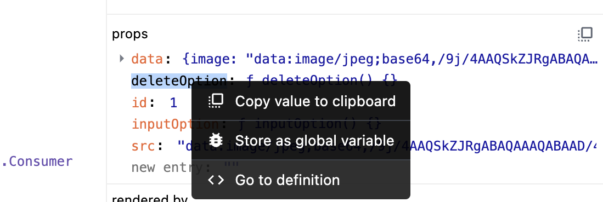
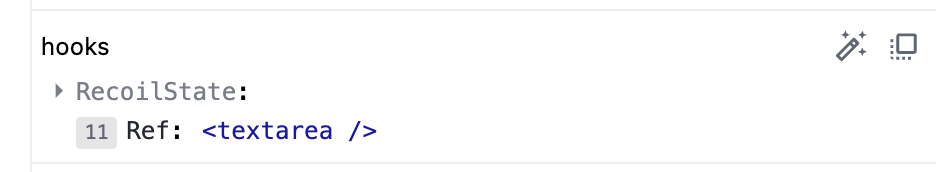
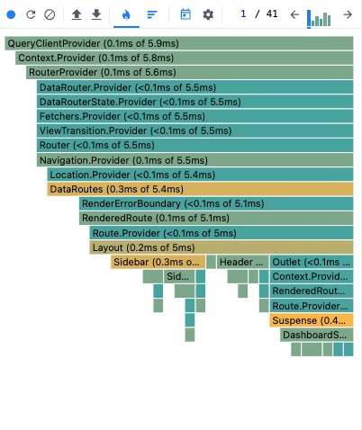
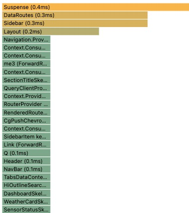

# 6장: 리액트 개발 도구로 디버깅하기

## 컴포넌트

- Components 탭에서는 현재 리액트 애플리케이션의 컴포넌트 트리를 확인할 수 있다 (props 와 hooks 등의 정보도 확인 가능).

- 익명함수는 Anonymous로 표기되기 때문에 디버깅을 위해 `displayName` 사용 혹은 기명 함수을 사용을 추천한다.
- 컴포넌트 hook에 대한 정보도 확인할 수 있다. 훅도 마찬가지로 `useEffect` 등에 기명함수로 넘겨주면 훅을 실행할 때 실행되는 함수의 이름을 확인할 수 있다.
- `renderd by`를 통해 해당 컴포넌트를 렌더링한 주체가 누구인지 확인할 수 있다.

### 컴포넌트의 props

- 함수의 경우 go to definition 을 클릭하면 해당 코드로 이동한다.



### 컴포넌트의 hooks

- 훅의 이름은 use 가 생략되어 나타나며 훅 또한 익명함수로 넘겨주게 되면 anonymous 로 표시되기에 기명함수로 넘겨주는것을 권장한다.

  

```js
useEffect(() => {});
대신;
useEffect(function effectOnly() {});
```

<br>

## 프로파일러

- 리액트가 렌더링하는 과정에서 발생하는 전체적인 상황을 파악한다.
- 어떤 컴포넌트가 렌더링되었는지, 리렌더링 발생 횟수, 각 컴포넌트간 렌더링 속도 비교를 통해 불필요한 렌더링을 줄이거나, 렌더링 속도를 개선할 때 유용하다.


리스트 왼쪽에서 부터

1. `Start Profiling` - 프로파일링 시작, 다시 클릭시 중단 및 결과 출력한다.
2. `Reload and Start profiling`- 웹페이지 새로고침 되면서 프로파일링 시작한다.
3. `Stop Profiling`- 프로파일링 기록 모두 삭제한다.
4. `Load Profile`, `Save Profile` 프로파일 불러오고 저장하기. 저장하면 브라우저에 json 파일 다운로가 가능하다.
5. `Flamegraph` 🔥 - 렌더링 과정의 작업 결과를 나타내는 항목



바의 너비가 넓을수록 해당 컴포넌트를 렌더링하는 데 오래 걸렸다는 것을 의미한다

6. `graph` 📊 - 해당 커밋에서 렌더링 하는데 오랜 시간이 걸린 컴포넌트를 순서대로 나열한 그래프를 확인할 수 있다.


