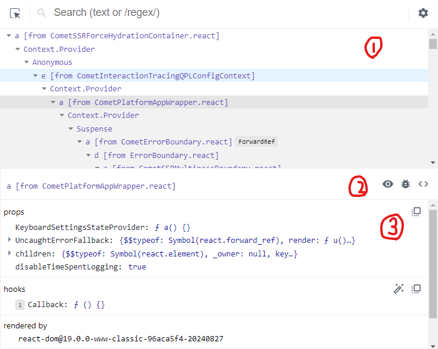

# 리액트 개발 도구 -components 탭

# 특징

현재 페이지에 렌더링된 React 컴포넌트 트리를 보여주는 탭입니다.

컴포넌트 트리 뿐만 아니라 각 컴포넌트의 props, hooks, rendered by 등을 알수있습니다.



## 1. 컴포넌트 트리

1번에 보이는 영역은 리액트 페이지의 컴포넌트 트리구조를 보여준다.

> **Anonymous는 뭔가요?**

기명함수로 선언되어 컴포넌트명을 알수있다면 해당 컴포넌트명을 보여주지만

컴포넌트 명칭을 제대로 추론하지 못하는 상황이라면 Anonymous라는 이름으로 보여준다

```jsx
import React, { ComponentType, memo } from "react";
import AnonymousDefaultComponent from "./Component3";

// 함수 선언문
const Component1 = () => {
  return <>Component1</>;
};

// 함수 표현식
const Component2 = () => {
  return <>Component2</>;
};

// 메모된 컴포넌트
const MemoizedComponent = memo(() => <>MemoizedComponent</>);

const withHOC = (Component: ComponentType) => {
  return function () {
    return <Component />;
  };
};

// 고차 컴포넌트로 감싼 컴포넌트
const HOCComponent = withHOC(() => <>HOCComponent</>);

export default function App() {
  return (
    <div>
      <Component1 />
      <Component2 />
      <AnonymousDefaultComponent />
      <MemoizedComponent />
      <HOCComponent />
    </div>
  );
}
```

위 코드에서

`<AnonymousDefaultComponent />` ⇒ \_default

`<MemoizedComponent />`=> Anonymous `memo`

`<HOCComponent />` ⇒ Anonymous 중첩 트리

로 나오는데 이유를 알아보자

- `<AnonymousDefaultComponent />` ⇒ \_default

익명함수를 default로 export한 `AnonymousDefaultComponent` 는 코드 내부에서 사용되는이름일뿐

실제로 default Export 로 내보낸 함수의 명칭은 추론할수없다.따라서 default로 표시된다.

- `<MemoizedComponent />`=> Anonymous `memo`

memo를 사용해 익명 함수로 만든 컴포넌트를 감싼 경우, 함수명을 명확히 추론하지 못한다 ⇒

따라서 Anonymous로 표시되며 memo라벨을 통해 memo로 감싸진 컴포넌트임을 알수있게 하였다.

- `<HOCComponent />` ⇒ Anonymous

고차컴포넌트인 `withHOC` 로 감싼 `HOCComponent` 컴포넌트의 경우 두가지 모두 Anonymous로 선언되어있다

⇒ 고차 컴포넌트의 명칭을 제대로 추론하지못한다.

    이로 알수있는것은 컴포넌트 탭에서 컴포넌트 트리의 구조를 파악하기 쉽게하기위해서는 기명함수로 작성해야 좋다

    기명함수로 바꾸기 어러운 컴포넌트라면 함수에 displayName속성을 추가하는 방법도 있다.

```jsx
// 메모된 기명 함수 컴포넌트

const MemoizedComponent = memo(function MemoizedComponent() {
  return <>MemoizedComponent</>;
});

// displayName 설정
MomoizedComponent.displayName = "메모된 컴포넌트입니다";

const withHOC = (Component: ComponentType) => {
  return function withHOC() {
    return <Component />;
  };
};

// 고차 컴포넌트로 감싼 기명 함수 컴포넌트
const HOCComponent = withHOC(function HOCComponent() {
  return <>HOCComponent</>;
});
```

### 참고사항

    개발모드로 확인하는것이아닌 리액트를 빌드한 트리를 확인하는경우 기명함수로 선언한다해도 terser등의 압축도구등이 컴포넌트명을 단순하게 난수화하기 때문에 확인하기 어려워진다.

    displayName 경우에도 빌드도구가 사용하지않는 코드로 인식해 코드를 삭제할 가능성도있다

    따라서 함수명과 displayName은 개발모드에서만 제한적으로 참고하는것이 좋다.

# 2.컴포넌트 도구

### 눈아이콘

첫번째 눈아이콘을 누르면 해당컴포넌트가 HTML의 어디에서 렌더링되었는지 확인할수있다 elements 탭으로 즉시 이동

### 벌레 아이콘

두번째 벌레아이콘을 클릭하면 console탭에 해당컴포넌트의 정보가 기록되어진다.

console에는 props,hooks,nodes 가 표시된다.

### 소스코드 아이콘

세번째 소스코드 아이콘을 클릭하면 해당 컴포넌트의 소스 코드를 확인할수있다.

코드가 난독화 되어있다면 {} 버튼을 클릭해 원래 찾으려했던 소스코드를 확인할수있다.

# 3.컴포넌트의 props, hooks, rendered by

### props

해당 컴포넌트가 받은 props

마우스 우클릭할 시

- 원시값: props 정보 복사하는 Copy value to clipboard(클립보드에복사), Store as global variable(window.$r에복사 console에 해당 변수 정보가 찍힌다)
- 함수: 원시값정보에 추가로 Go to definition이 나타난다(함수가 선언된 코드로 이동)

### hooks

컴포넌트에서 사용 중인 훅 정보

use가 생략된 이름으로 나타난다

만약 리액트에서 정의되지않은 명칭이 보인다면 사용자 커스텀훅임을 알수있다.

훅또한 기명함수로 작성해주면 해당함수의 이름을 확인할수있다

### rendered by

컴포넌트를 렌더링한 주체

프로덕션 모드에서는 react-dom의 버전만 확인 가능하지만, 개발 모드에서는 해당 컴포넌트를 렌더링한 부모 컴포넌트까지 확인할 수 있다.
