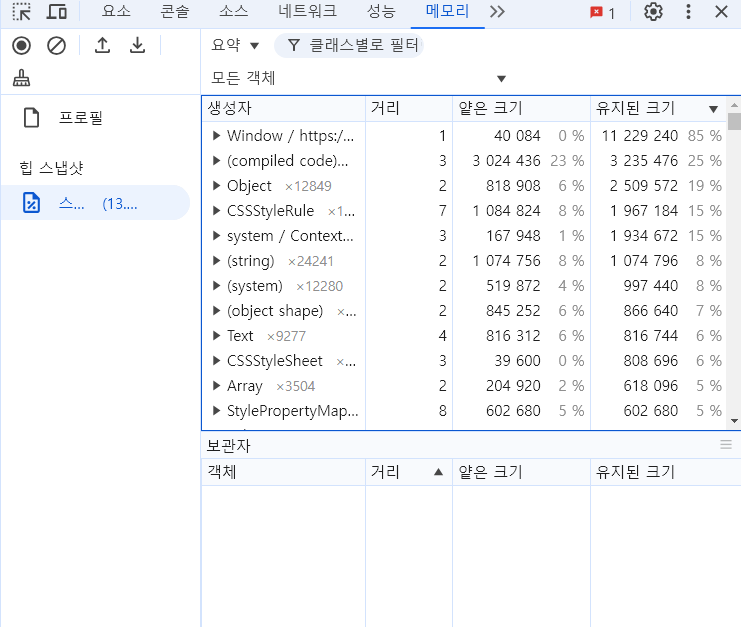

# 새롭게 안 사실들.. (모리딥7장)

# 1. 시크릿 모드로 디버깅을 해라!

### 브라우저에 설치되어있는 각종 확장 프로그램이 전역 변수나 HTML요소에 다른 정보를 추가할수있기때문에 디버깅하는데 방해가 될수있다

### 일부 설정에 따라 시크릿모드에서도 실행될수 있는 확장 프로그램이있다면 꺼두거나 삭제후 디버깅

# 2. 중단점 사용하기

### 요소 탭

### 코드에 의해 클래스나 속성값이 동적으로 제어되는 DOM이 있다면 요소의 중단점을 사용해 디버깅할수있다 .

### 요소의 중단 위치를 설정해두면 중단과 관련된 작업이 일어날때마다 브라우저가 렌더링을 중단하고 해당 요소 변경을 일으킨 소스코드를 보여준다.

### 소스 탭

### 소스 중단점을 생성해 자바스크립트 실행을 중단시키고 디버깅을 수행할수있다

### 코드의 debugger를 선언하는것과 동일한 역할을 하지만 소스코드를 오염시키지않는점에서 더 유용하다

# 3. 네트워크 탭을 이용해 최적화 잘되는지 확인하기

### 현재 페이지에 불필요한 요청이 들어있거나 중복된 요청이 포함되어있는지 확인할수있다.

### 다운로드한 리소스의 크기를 확인하여 이미지 최적회를 진행 할 수있다.

### 리소스가 올바른 우선순위로 다운로드되어있는지 확인하여 레이지 로딩등 리소스 다운이 필요한 시기에 됐는지 확인할수있다.

# 4. 메모리 탭

### 얕은 크기 - 객체 자체가 보유하는 메모리 바이트 크기

### 유지된 크기 - 해당 객체 자체뿐만 아니라 다른 부모가 존재하지 않는 모든 자식 객체들의 크기까지 더한값

### 메모리 누수를 찾을때는 얕은크기는 작으나 유지된크기가 큰 객체를 찾아야 한다. 두 크기의 차이가 큰 객체는 다수의 다른객체를 참조하고있다는 뜻이다.

### 따라서 메모리 누수가 의심스럽다면 두 크기의 차이가 큰 객체를 최우선으로 찾아야한다
