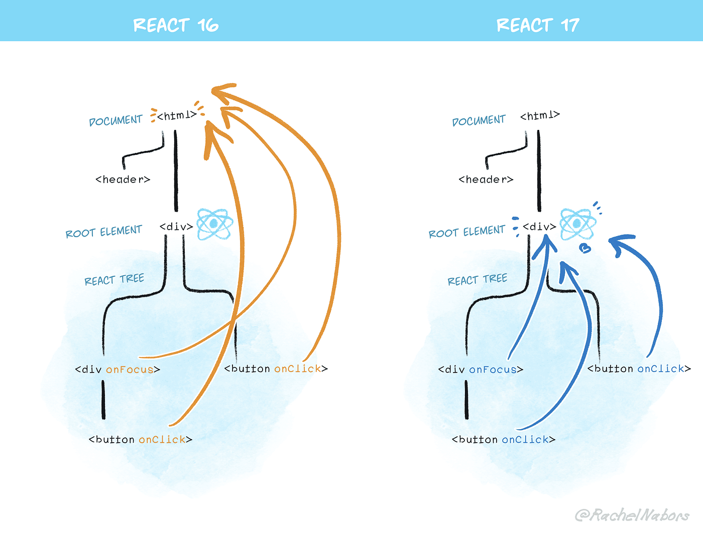

# 리액트 17과 18의 변경 사항 살펴보기

## 리액트 17 버전 살펴보기

### 1. 리액트의 점진적인 업그레이드

- 전체 애플리케이션 트리에 리액트 17, 18버전을 선택적으로 사용하는 점진적인 버전 업이 가능
- 리액트 버전을 한꺼번에 업데이트하는 게 복잡성 감소 측면에서 좋다.

### 2. 이벤트 위임 방식의 변경
- 캡처 이벤트 핸들러가 최상단 요소부터 시작해서 실제 이벤트 타깃 요소 까지 전달하는 것을 의미
- 타깃: 이벤트 핸들러가 노드에 도달하는 단계를 의미.
- 버블링: 이벤트가 발생한 요소에서부터 시작해 최상위 요소까지 다시 전파.
- 리액트 애플리케이션에서 DOM에 이벤트 추가

```jsx
// react 16 이전
document.addEventListener();

// react 17 이후
const rootNode = document.getElementById('root');
rootNode.addEventListener();
```

핸들러를 HTML문서의 Document에 부착하지 않고, root DOM container에 부착하는 방식으로 변경되었다.

### 그렇다면 왜?



- 기존(17버전 이전)에는 규모가 큰 앱의 리액트 버전을 업데이트 할 때, 한번에 업데이트 하지 않고 부분부분 업데이트를 하는 상황, 즉 하나의 애플리케이션에서 서로 다른 버전의 리액트가 존재하는 상황에서 이러한 이벤트 핸들링의 방식이 버그 요인으로 지목 되었음.

```jsx
// React 16 버전으로 작성된 첫 번째 애플리케이션
import React from 'react';
import ReactDOM from 'react-dom';

function App1() {
  return (
    <button
      onClick={() => {
        console.log('React 16: Button clicked');
      }}
    >
      React 16 Button
    </button>
  );
}

ReactDOM.render(<App1 />, document.getElementById('root1'));

// React 15 버전으로 작성된 두 번째 애플리케이션 (가상으로 가정)
function App2() {
  return (
    <button
      onClick={() => {
        console.log('React 15: Button clicked');
      }}
    >
      React 15 Button
    </button>
  );
}

ReactDOM.render(<App2 />, document.getElementById('root2'));

// 두 애플리케이션의 이벤트가 모두 document에 부착되어 버그 가능성 존재
```

- 하나의 애플리케이션에서 서로 다른 두 버전의 리액트가 존재한다고 했을 때, 두 버전의 리액트가 모두 Document Level에 이벤트 리스너를 부착하기 때문에 버그가 생기기 쉬운 환경이 되는 것

```jsx
// React 17 버전으로 작성된 첫 번째 애플리케이션
import React from 'react';
import ReactDOM from 'react-dom';

function App1() {
  return (
    <button
      onClick={() => {
        console.log('React 17: Button clicked');
      }}
    >
      React 17 Button
    </button>
  );
}

// React 17 버전에서는 root DOM container에 이벤트 리스너를 부착
ReactDOM.render(<App1 />, document.getElementById('root1'));

// React 18 버전으로 작성된 두 번째 애플리케이션
import { createRoot } from 'react-dom/client';

function App2() {
  return (
    <button
      onClick={() => {
        console.log('React 18: Button clicked');
      }}
    >
      React 18 Button
    </button>
  );
}

// React 18 버전도 각자의 root DOM container에 이벤트 리스너를 부착
const container = document.getElementById('root2');
const root = createRoot(container);
root.render(<App2 />);
```

- 17 버전 이후에는 이벤트 리스너를 Document Level이 아닌 root DOM container에 부착함으로써, 서로 다른 버전의 리액트가 각자 자신의 root DOM container에서 이벤트 리스너를 각기 운영할 수 있게 됨.

- 따라서 이후 리액트 20버전에서 이벤트를 처리하는 방식이 매우 급진적으로 변경되어도 (Dramatic Change) 해당 버전의 이벤트 처리 방식의 적용은 해당 리액트를 사용한 root DOM container의 하위 요소들에만 적용이되고, 기존 17버전의 리액트를 사용한 컴포넌트들은 여전히 안정적으로 17버전의 이벤트 처리 방식을 사용할 수 있게 되는 원리이다.


<h3>React 16까지의 코드 예시</h3>

```jsx
import React from 'react';

function MyComponent() {
  return <h1>Hello, World!</h1>;
}

export default MyComponent;
```

- JSX 구문 Hello, World!을 사용하기 때문에 반드시 React를 import 문을 추가해야 함.

```jsx
function MyComponent() {
  return <h1>Hello, World!</h1>;
}
export default MyComponent;
```

- React 17 이후부터는 더 이상 import React from 'react'가 필요하지 않으며, Babel이나 TypeScript가 JSX를 변환할 때 내부적으로 자동으로 필요한 React 호출을 처리하기 때문에 JSX를 그대로 사용할 수 있다.

참고: https://blog.mathpresso.com/react-deep-dive-react-event-system-2-1d0ad028308b
