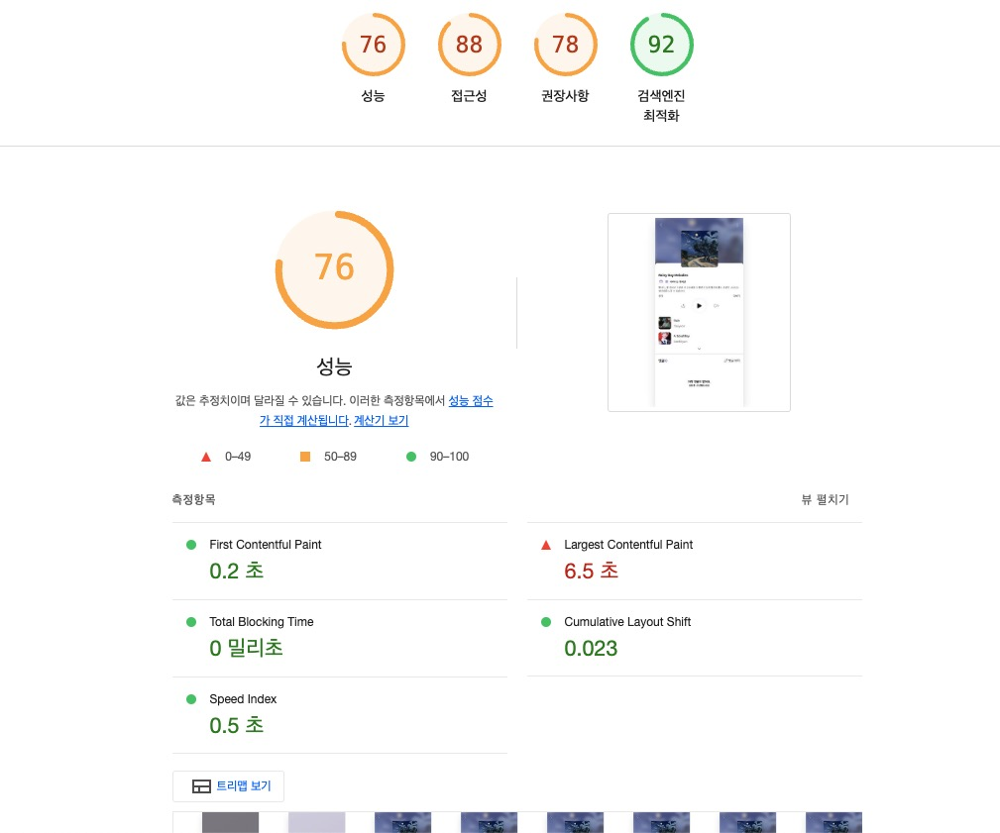
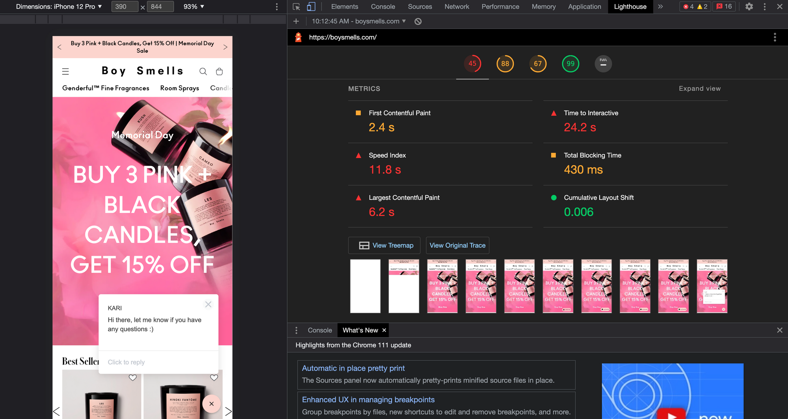

# 12. 모든 웹 개발자가 관심을 가져야 할 핵심 웹 지표

## LightHouse



- 구글에서 만든, 웹사이트에서 뛰어난 사용자 경험을 제공하는 데 필수적인 지표

### 핵심 웹 지표

- 최대 콘텐츠풀 페인트 (LCP : Largest Contentful Paint)
- 최초 입력 지연 (FID : First Input Delay)
- 누적 레이아웃 이동 (CLS : Cumulative Layout Shift)

### 그 외 지표

- 최초 바이트까지의 시간 (TTFB : Time To First Byte)
- 최초 콘텐츠풀 시간 (FCP : First Contentful Paint)

## 최대 콘텐츠풀 페인트(LCP)



- 페이지가 처음으로 로드를 시작한 시점부터 뷰포트 내부에서 <strong>가장 큰 이미지 또는 텍스트를</strong> 렌더링하는 데 걸리는 시간

- "뷰포트" : 사용자에게 현재 노출되는 화면
  (뷰포트 크기는 기기마다 다름)

### 뷰포트 내부의 '큰 이미지와 텍스트란?'

```

<svg> 내부의 <image>
poster 속성을 사용하는 <video>
url()을 통해 불러온 배경 이미지가 있는 요소
텍스트와 같이 인라인 텍스트 요소를 포함하고 있는 블록 레벨 요소
블록 레벨에는  <p>, <div> 등이 포함됨
```

- 이미지와 텍스트가 각각 사용자의 시점에 언제 노출됐는지를 확인하는 정확한 시점은, 각 엘리먼트가 등장한 시점부터 텍스트 또는 이미지가 완전히 로딩되는 시점
  → 즉, LCP란 사용자의 기기가 노출하는 뷰포트 내부에서 가장 큰 영역을 차지하는 요소가 렌더링되는 데 얼마나 걸리는지를 측정한 지표

- 실제 크기가 크다고 하더라도, 뷰포트 영역 밖에 넘치는 요소가 있다면 해당 영역의 크기는 고려 X
  의미

### LCP는 지표 점수

- 2.5초 내로 응답 : 좋음
- 4초 이내로 응답: 보통
- 4초 이상 : 나쁨

### 개선방안

- 뷰포트 최대 영역, 즉 LCP 예상 영역에 이미지가 아닌 문자열을 넣는 것
- 아무리 이미지를 최적화하더라도, 추가적인 리소스 다운로드가 필요한 이미지보다 텍스트 노출이 훨씬 더 빠름

## 이미지는 어떻게 불러올 것인가?

```
<!-- 1) img -->


<!-- 2) svg -->
<svg xmlns="http://www.w3.org/1000/svg">
  <image href="lcp.jpg" />
</svg>

<!-- 3) (비디오의 경우) video.poster -->

<video poster="lcp.jpg"></video>

<!-- 4) background-image: url() -->
<div style="background-image: url(lcp.jpg)">...</div>
→ img, video 가 이미지 노출 속도 빠름

```

- `` 이미지는 브라우저의 프리로드 스캐너에 의해 먼저 발견되어 빠르게 요청이 일어남

  - 프리로드 스캐너 : HTML을 파싱하는 단계를 차단하지 않고, 이미지와 같이 빠르게 미리 로딩하면 좋은 리소스를 먼저 찾아 로딩하는 브라우저의 기능

- `<svg>` 내부의  프리로드 스캐너에 의해 발견되지 않아 병렬적으로 다운로드가 일어나지 않음
- `<video>` 의 poster : 사용자가 video 요소를 재생하거나 탐색하기 전까지 노출되는 요소
  마찬가지로 프리로드 스캐너에 의해 조기에 발견되어 와 같은 성능을 보임

  - poster가 없는 video의 경우, video를 실제로 로딩해 첫 번째 프레임을 해당 poster 리소스로 대체, 따서 video가 LCP에 영향을 받을 것 같다면 poster를 반드시 넣어주는 게 중요함

- `background-image` : url():background-image를 비롯해서 CSS에 있는 리소스 요소는 항상 느림
  - 브라우저가 해당 리소스를 필요로 하는 DOM을 그릴 준비가 될 때까지, 리소스 요청을 뒤로 미루기 때문

## 그 밖에 주의 사항

- 이미지 무손실 압축 :웹으로 서비스할 이미지는, 가능한 한 무손실 형식으로 압축해 최소한의 용량으로 서비스하는 것이 좋음

  - LCP 요소에는 `loading=lazy` 속성 사용을 지양할것

- loading=lazy 란? : 리소스를 중요하지 않음으로 표시하고, 필요할 때만 로드하는 전략
- fadein과 같은 각종 애니메이션: fadeIn ease 10s 등등 애니메이션 처리를 한다면, LCP도 그만큼 늦어짐

- 클라이언트에서 빌드하는 것을 지양할것

최적의 시나리오 : 서버에서 빌드해온 HTML을 프리로드 스캐너가 바로 읽어서 LCP로 빠르게 가져가는 것
Next.js Page Roure 예제 코드 (서버 사이드 렌더링을 통한 LCP 최적화)

```tsx
// pages/index.js

import React from 'react';

// getServerSideProps 함수를 통해 서버에서 데이터를 미리 가져오고 HTML에 포함
export async function getServerSideProps() {
  const res = await fetch('https://image.com/api/data');
  const data = await res.json();
  return {
    props: {
      content: data, // 서버에서 데이터를 미리 렌더링하여 클라이언트가 곧바로 접근 가능
    },
  };
}
```

## LCP는 되도록이면 같은 도메인에서 직접 호스팅하는 게 좋다

- 보통 Coludinary 같은 이미지 최적화 서비스를 사용해 하나의 이미지에 대해 크기도 줄이고, 포맷도 변환하고, 압축해서 이미지를 관리하지만, 다른 출처(origin)에서 이렇게 정제한 이미지를 가져오는 것은 최적화에 별로 좋은 영향을 미치지 않는다.

- 이미 연결이 맺어진 현재 출처와는 달리, 완전히 새로운 출처의 경우에는 네트워크 커넥션부터 다시 수행해야 하기 때문

- 중요한 리소스는 직접 다루고, 덜 중요한 리소스에 대해서만 이미지 최적화 서비스를 사용하는 식으로 관리하는 게 좋음

### 예시: 이미지가 외부 도메인에서 호스팅되는 경우

```js
<!DOCTYPE html>
<html lang="en">
<head>
    <title>External Image Example</title>
</head>
<body>
    <!-- 외부 도메인에서 LCP에 중요한 이미지 로드 -->
    
</body>
</html>
```

### 예시: 이미지가 같은 도메인에서 직접 호스팅되는 경우

```js
<!DOCTYPE html>
<html lang="en">
<head>
    <title>Same Domain Image Example</title>
</head>
<body>
    <!-- 같은 도메인에서 LCP에 중요한 이미지 로드 -->
    
</body>
</html>

```
